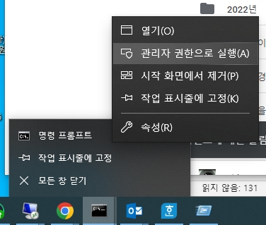

- 네이버 드라이브가 안 됩니다! 네, 방화벽에서 차단하고 있습니다ㅠ
- 투두잇? 방화벽을 우회합니다.
- 관리자 권한으로 커맨트창을 엽니다.  

~~~
>route print | more
===========================================================================
인터페이스 목록
 13...a4 bb 6d d8 de 73 ......Intel(R) Ethernet Connection (5) I219-LM          <- 제일 앞 숫자, 인터페이스 번호를 알아야 함.
  1...........................Software Loopback Interface 1
 22...00 15 5d e6 5f 81 ......Hyper-V Virtual Ethernet Adapter
===========================================================================

IPv4 경로 테이블
===========================================================================
활성 경로:
네트워크 대상      네트워크 마스크     게이트웨이      인터페이스    메트릭
          0.0.0.0          0.0.0.0  192.168.100.254  192.168.100.142    306
......
~~~
